# System Architecture

## Table of Contents

1. [Overview](#overview)
2. [High-Level Architecture](#high-level-architecture)
3. [Core Components](#core-components)
4. [Data Flow](#data-flow)
5. [Technology Stack](#technology-stack)
6. [Scalability Architecture](#scalability-architecture)
7. [Security Architecture](#security-architecture)
8. [Deployment Architecture](#deployment-architecture)
9. [Integration Points](#integration-points)

---

## Overview

PM Document Intelligence is built as a modern, cloud-native microservices architecture designed for scalability, reliability, and performance. The system processes project management documents through an AI-powered pipeline that extracts insights, generates summaries, identifies action items, and enables intelligent search.

### Design Principles

- **Modularity**: Loosely coupled components with clear interfaces
- **Scalability**: Horizontal scaling for all stateless components
- **Resilience**: Fault tolerance with circuit breakers and retries
- **Security**: Defense in depth with encryption at rest and in transit
- **Observability**: Comprehensive monitoring and logging
- **Cost Optimization**: Intelligent routing and caching to minimize AI costs

---

## High-Level Architecture

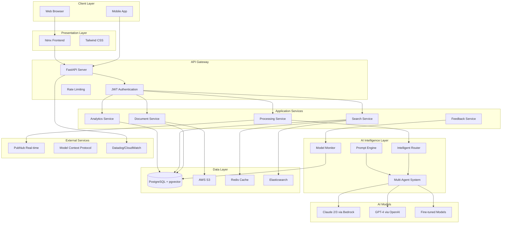

---

## Core Components

### 1. Presentation Layer

#### htmx Frontend
- **Technology**: htmx + Tailwind CSS + Alpine.js
- **Purpose**: Dynamic, interactive UI without heavy JavaScript frameworks
- **Features**:
  - Server-driven HTML updates
  - Real-time document processing status
  - Drag-and-drop file upload
  - Interactive dashboards and analytics
  - Responsive design for mobile/tablet

**Rationale**: htmx provides React-like interactivity with minimal JavaScript, reducing complexity and improving performance. Server-side rendering simplifies state management and SEO.

### 2. API Gateway Layer

#### FastAPI Server
- **Technology**: FastAPI (Python 3.11+)
- **Purpose**: High-performance async API server
- **Features**:
  - OpenAPI/Swagger automatic documentation
  - Async request handling
  - Pydantic validation
  - Dependency injection
  - WebSocket support for real-time features

**Key Routes**:
```
/api/auth/*          - Authentication & authorization
/api/documents/*     - Document management
/api/process/*       - Document processing
/api/search/*        - Semantic search
/api/analytics/*     - Usage analytics
/api/organizations/* - Multi-tenancy
/api/models/*        - Model management & feedback
```

### 3. Application Services

#### Document Service
```python
# backend/app/services/document_service.py
Responsibilities:
- Document upload and validation
- Metadata extraction
- Storage management (S3)
- Document versioning
- Access control
```

#### Processing Service
```python
# backend/app/services/processing_service.py
Responsibilities:
- Text extraction (Textract, PyPDF, python-docx)
- Document type classification
- AI agent orchestration
- Result aggregation
- Status tracking
```

#### Search Service
```python
# backend/app/services/search_service.py
Responsibilities:
- Vector embedding generation
- Semantic search (pgvector)
- Hybrid search (vector + keyword)
- Result ranking
- Search analytics
```

#### Analytics Service
```python
# backend/app/services/analytics_service.py
Responsibilities:
- Usage tracking
- Cost analytics
- Performance metrics
- User activity monitoring
- Dashboard data aggregation
```

### 4. AI Intelligence Layer

#### Intelligent Router
```python
# ml/optimization/intelligent_router.py
Purpose: Route requests to optimal AI models based on complexity and requirements

Decision Logic:
1. Assess document complexity (simple/moderate/complex)
2. Evaluate requirements (accuracy/cost/speed priorities)
3. Select model tier (Fast-Cheap/Balanced/Premium)
4. Check cache for existing results
5. Route to selected model

Model Tiers:
- Fast-Cheap: GPT-3.5, Claude Instant ($0.002/1K tokens, 500ms)
- Balanced: GPT-4, Claude 2 ($0.03/1K tokens, 2000ms)
- Premium: GPT-4 Turbo, Claude 2.1 ($0.01/1K tokens, 1500ms)
```

#### Multi-Agent System
```python
# backend/app/agents/
Specialized Agents:
- SummaryAgent: Executive summaries (short/medium/detailed)
- ActionItemAgent: Extract tasks with owners and deadlines
- RiskAssessmentAgent: Identify project risks
- QAAgent: Answer questions about documents
- SynthesisAgent: Multi-document analysis
```

Agent Architecture:
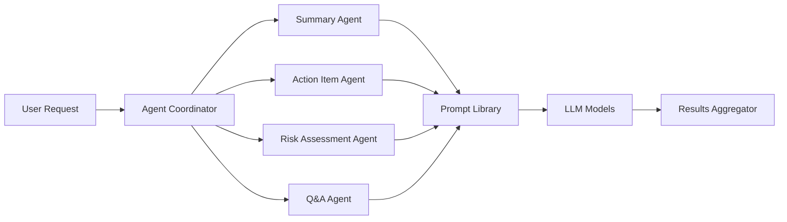

#### Prompt Engineering System
```python
# ml/models/prompt_templates.py
Features:
- 10+ optimized prompt templates
- Dynamic prompt assembly
- Few-shot learning examples
- Chain-of-thought prompting
- A/B testing framework
- Performance tracking
```

### 5. Data Layer

#### PostgreSQL + pgvector
```sql
Core Tables:
- users: User accounts and profiles
- organizations: Multi-tenant organization data
- documents: Document metadata and references
- processing_results: AI-generated outputs
- vector_embeddings: Document embeddings for search
- feedback: User feedback and corrections
- model_performance: Model metrics and drift tracking
```

**Schema Design**:
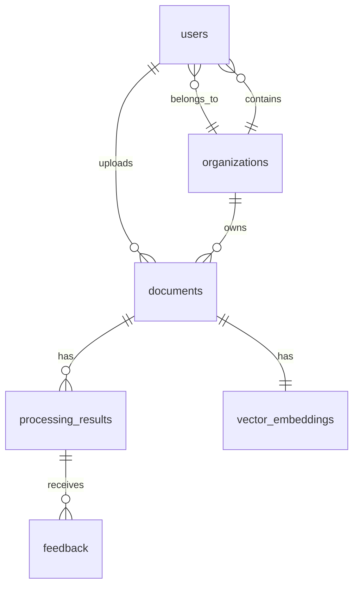

#### AWS S3
```
Bucket Structure:
/documents/{org_id}/{doc_id}/original.{ext}
/documents/{org_id}/{doc_id}/processed.txt
/exports/{org_id}/{export_id}.{format}
/training-data/{dataset_id}/train.jsonl
/training-data/{dataset_id}/validation.jsonl
```

#### Redis Cache
```
Cache Strategy:
- API responses: 5-minute TTL
- AI outputs: 24-hour TTL (semantic cache)
- Search results: 10-minute TTL
- User sessions: JWT duration
- Rate limiting: Sliding window

Cache Keys:
cache:api:{endpoint}:{hash}
cache:ai:{model}:{doc_hash}:{task}
cache:search:{query_hash}
cache:ratelimit:{user_id}:{endpoint}
```

---

## Data Flow

### Document Processing Pipeline

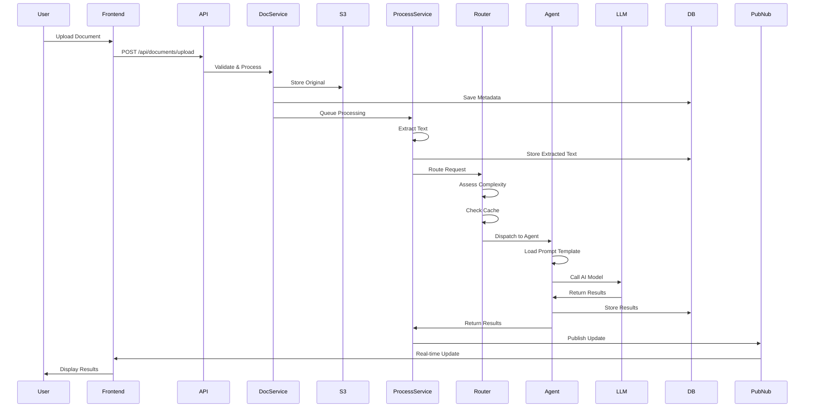

### Search Flow

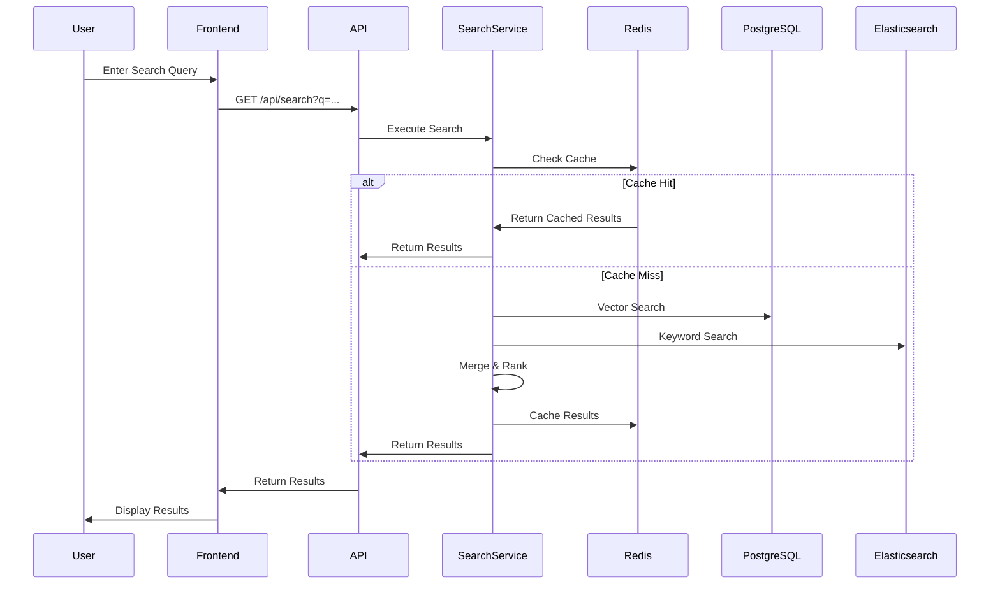

### Feedback Loop

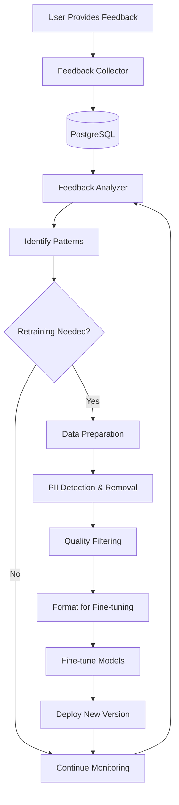

---

## Technology Stack

### Backend Framework
**Choice: FastAPI**

Rationale:
- High performance (async/await support)
- Automatic API documentation (OpenAPI/Swagger)
- Type safety with Pydantic
- Easy dependency injection
- Active community and ecosystem

Alternatives Considered:
- Django: Too heavy, synchronous by default
- Flask: Lacks built-in validation and async support
- Node.js: Python ecosystem better for ML/AI integration

### Database
**Choice: PostgreSQL 15+ with pgvector**

Rationale:
- ACID compliance for critical data
- pgvector extension for efficient vector search
- JSON support for flexible schemas
- Mature replication and backup tools
- Excellent performance for complex queries

Alternatives Considered:
- MongoDB: Less suitable for relational data, no vector support
- MySQL: Lacks advanced JSON and vector features
- Pinecone/Weaviate: Additional cost, complexity of managing separate vector DB

### AI Models
**Choice: Multi-model approach (Claude + GPT-4)**

Claude (via AWS Bedrock):
- Superior reasoning and analysis
- Lower cost for complex tasks
- Constitutional AI for safer outputs
- Fine-tuning capabilities

GPT-4 (via OpenAI):
- Excellent for structured outputs
- Strong function calling
- Widely tested and documented

Rationale:
- Model diversity reduces vendor lock-in
- Different models excel at different tasks
- Fallback options improve reliability

### Caching
**Choice: Redis**

Rationale:
- In-memory performance
- Built-in TTL support
- Pub/sub for real-time features
- Simple key-value operations
- Clustering for scalability

### Search
**Choice: Hybrid (pgvector + Elasticsearch)**

Rationale:
- pgvector: Semantic search with vector embeddings
- Elasticsearch: Fast full-text search
- Hybrid approach leverages strengths of both
- Single database reduces operational complexity

### Frontend
**Choice: htmx + Tailwind CSS**

Rationale:
- Minimal JavaScript complexity
- Server-driven updates (HATEOAS)
- Excellent performance
- Easy to maintain and test
- Tailwind provides consistent design system

Alternatives Considered:
- React: Overkill for document management UI
- Vue: Unnecessary complexity for use case
- Angular: Too heavy and opinionated

### Real-time Communication
**Choice: PubNub**

Rationale:
- Managed service (no infrastructure)
- Global edge network for low latency
- Built-in presence and history
- Simple pub/sub API
- Cost-effective for moderate usage

Alternatives Considered:
- WebSockets (DIY): Requires complex infrastructure
- Firebase: More expensive, tightly coupled to Google ecosystem
- Socket.io: Self-hosted, operational overhead

---

## Scalability Architecture

### Horizontal Scaling

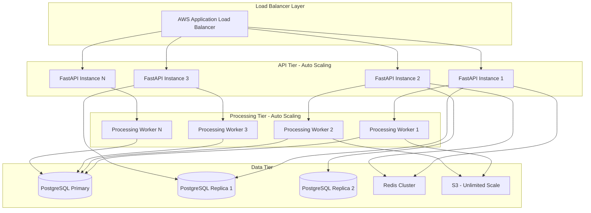

### Scaling Strategies

#### API Layer
```yaml
Auto Scaling Configuration:
  Min Instances: 2
  Max Instances: 20
  Target CPU: 70%
  Target Memory: 80%
  Scale Up: +2 instances when CPU > 70% for 2 minutes
  Scale Down: -1 instance when CPU < 30% for 5 minutes
```

#### Processing Workers
```yaml
Auto Scaling Configuration:
  Min Instances: 1
  Max Instances: 50
  Queue Depth Trigger: > 100 jobs
  Scale Up: +5 instances when queue > 100
  Scale Down: -1 instance when queue < 10 for 10 minutes
```

#### Database
```yaml
Read Scaling:
  Primary: 1 instance (write)
  Replicas: 2-5 instances (read)
  Read Routing: Round-robin across replicas

Write Scaling:
  Partitioning: By organization_id
  Sharding Strategy: Range-based (1-1000, 1001-2000, ...)

Connection Pooling:
  Min Connections: 10
  Max Connections: 100
  Timeout: 30s
```

### Caching Strategy

**Three-Tier Caching**:

1. **Application Cache (In-Memory)**
   - Prompt templates
   - Configuration data
   - User sessions (JWT)
   - TTL: Application lifetime

2. **Distributed Cache (Redis)**
   - API responses
   - Search results
   - Rate limiting data
   - TTL: 5-60 minutes

3. **Semantic Cache (AI Responses)**
   - AI-generated outputs
   - Hash-based deduplication
   - TTL: 24 hours

**Cache Invalidation**:
```python
# Invalidation triggers
- User updates document: Invalidate document cache
- New processing result: Invalidate search cache
- Organization setting change: Invalidate org cache
- Model update: Clear semantic cache
```

### Queue Architecture

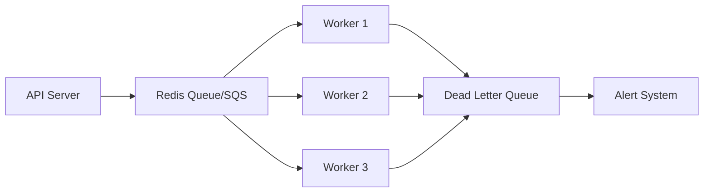

**Queue Configuration**:
```python
Priority Levels:
  Critical: User-initiated processing (0-5s delay)
  High: Real-time updates (5-30s delay)
  Normal: Batch processing (30s-5m delay)
  Low: Analytics, reporting (5m+ delay)

Retry Policy:
  Max Retries: 3
  Backoff: Exponential (1s, 4s, 16s)
  DLQ: After max retries
```

---

## Security Architecture

### Authentication & Authorization

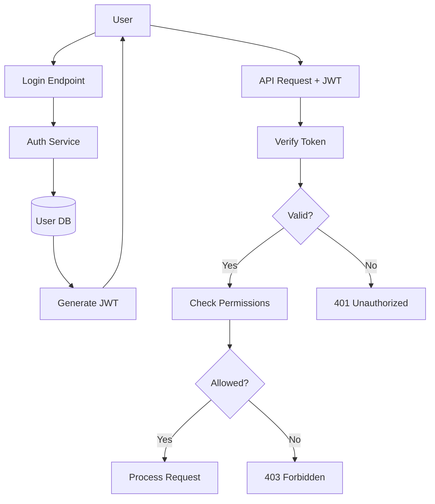

### JWT Token Structure
```json
{
  "sub": "user_id",
  "email": "user@example.com",
  "org_id": "organization_id",
  "role": "admin|member|viewer",
  "permissions": ["documents:read", "documents:write", "analytics:read"],
  "exp": 1234567890,
  "iat": 1234567890
}
```

### Role-Based Access Control (RBAC)

```python
Roles:
  SuperAdmin:
    - Full system access
    - Organization management
    - Billing management

  OrgAdmin:
    - Organization settings
    - User management
    - All documents in org

  OrgMember:
    - Upload documents
    - Process documents
    - View own documents
    - Share documents

  OrgViewer:
    - Read-only access
    - View shared documents
    - Search documents
```

### Data Security

**Encryption at Rest**:
```yaml
Database:
  - PostgreSQL: AES-256 encryption
  - Backups: Encrypted with AWS KMS

S3:
  - Server-side encryption: AES-256
  - KMS key per organization
  - Bucket versioning enabled

Redis:
  - Encrypted connections (TLS)
  - No sensitive data storage
```

**Encryption in Transit**:
```yaml
All Traffic:
  - TLS 1.3 required
  - Certificate: AWS ACM
  - Perfect Forward Secrecy

API:
  - HTTPS only
  - HSTS enabled
  - Certificate pinning for mobile
```

**PII Protection**:
```python
# ml/training/data_preparation.py
PIIDetector:
  - Email detection and redaction
  - Phone number masking
  - SSN removal
  - Credit card detection
  - Custom regex patterns

Training Data:
  - All PII removed before fine-tuning
  - Audit logs for data access
  - GDPR compliance
```

### Security Boundaries

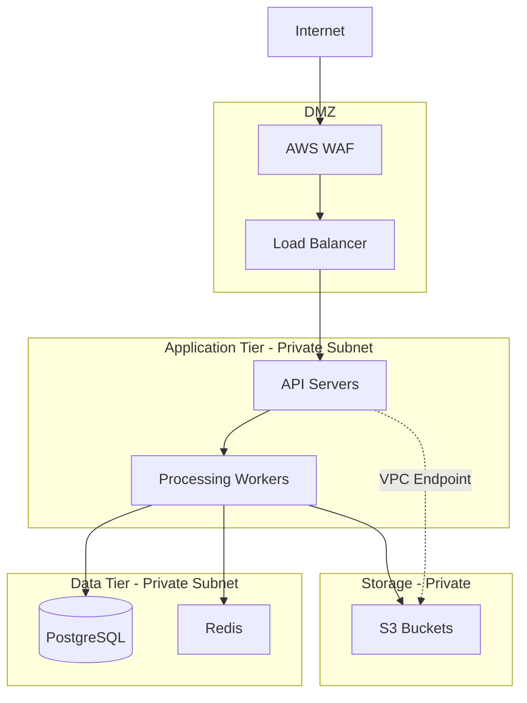

### Compliance

**GDPR Compliance**:
- Right to access: Export API endpoint
- Right to deletion: Cascade delete with audit
- Data portability: JSON/CSV export
- Consent management: Opt-in for analytics
- Data residency: EU region option

**SOC 2 Readiness**:
- Audit logging: All data access logged
- Access controls: RBAC enforced
- Encryption: At rest and in transit
- Monitoring: Real-time alerts
- Incident response: Documented procedures

---

## Deployment Architecture

### AWS Infrastructure

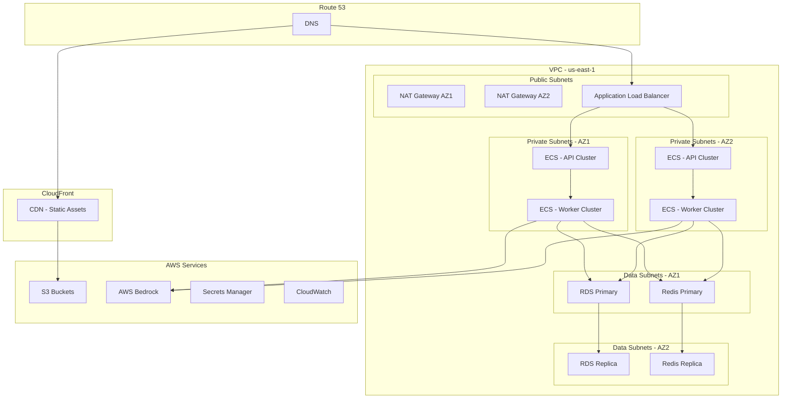

### Container Architecture

**Docker Images**:
```dockerfile
# API Container
FROM python:3.11-slim
WORKDIR /app
COPY requirements.txt .
RUN pip install -r requirements.txt
COPY backend/ backend/
COPY ml/ ml/
CMD ["uvicorn", "backend.app.main:app", "--host", "0.0.0.0", "--port", "8000"]

# Worker Container
FROM python:3.11-slim
WORKDIR /app
COPY requirements.txt .
RUN pip install -r requirements.txt
COPY backend/ backend/
COPY ml/ ml/
CMD ["python", "-m", "backend.workers.processing_worker"]
```

**ECS Task Definitions**:
```json
{
  "family": "pm-doc-intel-api",
  "cpu": "1024",
  "memory": "2048",
  "networkMode": "awsvpc",
  "requiresCompatibilities": ["FARGATE"],
  "containerDefinitions": [
    {
      "name": "api",
      "image": "pm-doc-intel-api:latest",
      "portMappings": [{"containerPort": 8000}],
      "environment": [
        {"name": "ENV", "value": "production"}
      ],
      "secrets": [
        {"name": "DATABASE_URL", "valueFrom": "arn:aws:secretsmanager:..."}
      ],
      "logConfiguration": {
        "logDriver": "awslogs",
        "options": {
          "awslogs-group": "/ecs/pm-doc-intel-api",
          "awslogs-region": "us-east-1",
          "awslogs-stream-prefix": "ecs"
        }
      }
    }
  ]
}
```

### CI/CD Pipeline

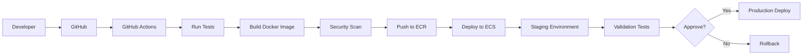

**GitHub Actions Workflow**:
```yaml
# .github/workflows/deploy.yml
name: Deploy
on:
  push:
    branches: [main]

jobs:
  test:
    runs-on: ubuntu-latest
    steps:
      - uses: actions/checkout@v3
      - name: Run tests
        run: |
          pip install -r requirements.txt
          pytest --cov=backend --cov-report=xml
      - name: Upload coverage
        uses: codecov/codecov-action@v3

  build:
    needs: test
    runs-on: ubuntu-latest
    steps:
      - uses: actions/checkout@v3
      - name: Build Docker image
        run: docker build -t pm-doc-intel:${{ github.sha }} .
      - name: Scan with Trivy
        run: trivy image pm-doc-intel:${{ github.sha }}
      - name: Push to ECR
        run: |
          aws ecr get-login-password | docker login --username AWS --password-stdin $ECR_REGISTRY
          docker push $ECR_REGISTRY/pm-doc-intel:${{ github.sha }}

  deploy-staging:
    needs: build
    runs-on: ubuntu-latest
    steps:
      - name: Deploy to ECS Staging
        run: |
          aws ecs update-service --cluster staging --service api --force-new-deployment

  deploy-production:
    needs: deploy-staging
    runs-on: ubuntu-latest
    environment: production
    steps:
      - name: Deploy to ECS Production
        run: |
          aws ecs update-service --cluster production --service api --force-new-deployment
```

### Monitoring & Observability

**Metrics Collection**:
```python
# Prometheus metrics
from prometheus_client import Counter, Histogram, Gauge

document_uploads = Counter('document_uploads_total', 'Total document uploads')
processing_duration = Histogram('processing_duration_seconds', 'Processing duration')
active_users = Gauge('active_users', 'Number of active users')
ai_costs = Counter('ai_costs_usd', 'AI API costs in USD')
```

**Logging Structure**:
```json
{
  "timestamp": "2024-01-15T10:30:00Z",
  "level": "INFO",
  "service": "api",
  "trace_id": "abc123",
  "user_id": "user_123",
  "org_id": "org_456",
  "endpoint": "/api/documents/upload",
  "duration_ms": 450,
  "status": 200,
  "message": "Document uploaded successfully"
}
```

**Alerting Rules**:
```yaml
Alerts:
  - name: HighErrorRate
    condition: error_rate > 5% for 5 minutes
    severity: critical
    action: PagerDuty

  - name: HighLatency
    condition: p95_latency > 3s for 10 minutes
    severity: warning
    action: Slack

  - name: AIModelDrift
    condition: accuracy_drop > 10%
    severity: critical
    action: PagerDuty + Email

  - name: HighAICosts
    condition: daily_cost > budget * 1.5
    severity: warning
    action: Email
```

---

## Integration Points

### AWS Bedrock (Claude)
```python
# Integration for Claude fine-tuning and inference
import boto3

bedrock = boto3.client('bedrock', region_name='us-east-1')
bedrock_runtime = boto3.client('bedrock-runtime', region_name='us-east-1')

# Inference
response = bedrock_runtime.invoke_model(
    modelId='anthropic.claude-v2',
    body=json.dumps({
        'prompt': prompt,
        'max_tokens_to_sample': 2000,
        'temperature': 0.7
    })
)
```

### OpenAI API
```python
# Integration for GPT-4 and fine-tuning
import openai

openai.api_key = os.getenv('OPENAI_API_KEY')

# Inference
response = openai.ChatCompletion.create(
    model='gpt-4',
    messages=[
        {'role': 'system', 'content': system_prompt},
        {'role': 'user', 'content': user_prompt}
    ],
    temperature=0.7
)
```

### PubNub Real-time
```python
# Real-time updates for processing status
from pubnub.pnconfig import PNConfig
from pubnub.pubnub import PubNub

pnconfig = PNConfig()
pnconfig.subscribe_key = os.getenv('PUBNUB_SUBSCRIBE_KEY')
pnconfig.publish_key = os.getenv('PUBNUB_PUBLISH_KEY')

pubnub = PubNub(pnconfig)

# Publish processing update
pubnub.publish().channel(f'document_{doc_id}').message({
    'status': 'processing',
    'progress': 45,
    'stage': 'ai_analysis'
}).sync()
```

### Model Context Protocol (MCP)
```python
# MCP integration for IDE integration
from mcp import MCPServer

mcp_server = MCPServer()

@mcp_server.tool("search_documents")
async def search_documents(query: str, limit: int = 10):
    """Search documents in PM Document Intelligence"""
    # Integration with search service
    results = await search_service.search(query, limit)
    return results
```

---

## Performance Characteristics

### Benchmarks

**API Response Times** (p50/p95/p99):
- Document upload: 200ms / 450ms / 800ms
- Document processing: 3s / 8s / 15s (async)
- Search query: 100ms / 250ms / 500ms
- Analytics dashboard: 300ms / 600ms / 1s

**Throughput**:
- Max documents/hour: 10,000 (with auto-scaling)
- Max concurrent users: 1,000
- Max API requests/second: 500

**Storage**:
- Document size limit: 50 MB
- Average document size: 2 MB
- Storage per 1000 docs: ~2 GB

### Resource Requirements

**Minimum Production Setup**:
```yaml
API Servers:
  - 2 x t3.medium (2 vCPU, 4 GB RAM)

Workers:
  - 2 x t3.large (2 vCPU, 8 GB RAM)

Database:
  - RDS db.t3.large (2 vCPU, 8 GB RAM)
  - Storage: 100 GB gp3

Redis:
  - ElastiCache cache.t3.medium (2 vCPU, 3.09 GB RAM)

Total Monthly Cost: ~$500-700
```

**Recommended Production Setup**:
```yaml
API Servers:
  - 3-10 x t3.large (auto-scaling)

Workers:
  - 5-20 x t3.xlarge (auto-scaling)

Database:
  - RDS db.r5.xlarge (4 vCPU, 32 GB RAM)
  - 2 read replicas
  - Storage: 500 GB gp3

Redis:
  - ElastiCache cache.r5.large cluster (3 nodes)

Total Monthly Cost: ~$2,000-4,000
```

---

## Design Decisions

See [Architecture Decision Records](ADR/) for detailed rationale on key decisions:

- [ADR-001: Choice of FastAPI](ADR/001-choice-of-fastapi.md)
- [ADR-002: Claude vs GPT-4 for Analysis](ADR/002-claude-vs-gpt4-for-analysis.md)
- [ADR-003: Vector Search Implementation](ADR/003-vector-search-implementation.md)
- [ADR-004: Multi-tenancy Approach](ADR/004-multi-tenancy-approach.md)

---

## Future Considerations

### Planned Enhancements

1. **GraphQL API**: In addition to REST for flexible queries
2. **Webhooks**: Outbound notifications for integrations
3. **Mobile SDK**: Native iOS/Android support
4. **Edge Computing**: CloudFlare Workers for global latency reduction
5. **Advanced ML**: Custom models trained on domain-specific data
6. **Multi-region**: Active-active deployment across regions

### Scalability Roadmap

**Current**: 10K documents/month, 100 concurrent users
**6 months**: 100K documents/month, 1K concurrent users
**12 months**: 1M documents/month, 10K concurrent users

**Required Changes**:
- Database sharding by organization
- Read replica auto-scaling
- Multi-region deployment
- CDN for API responses
- Dedicated AI inference endpoints

---

## Related Documentation

- [API Reference](API.md) - Complete API documentation
- [Deployment Guide](DEPLOYMENT.md) - Production setup instructions
- [Development Guide](DEVELOPMENT.md) - Local development setup
- [Security Documentation](SECURITY.md) - Security practices and compliance
- [ML Optimization Guide](ML_OPTIMIZATION_GUIDE.md) - AI model optimization

---

**Last Updated**: January 2024
**Version**: 1.0.0
**Maintainers**: Engineering Team
